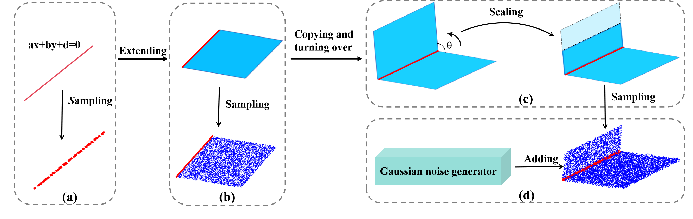

# **S2RDA:** ***a synthetic-to-real domain adaptation framework for label-efficient road boundary extraction from mobile laser scanning point clouds***
### **Introduction**
Road boundary extraction from 3D point clouds is critical for intelligent transportation systems. While current deep-learning-based methods achieve promising results, their heavy reliance on point-wise annotated datasets incurs prohibitive labeling costs. To address this, we propose a Synthetic-to-Real Domain Adaptation (S2RDA) framework that enables label-efficient road boundary extraction from Mobile Laser Scanning (MLS) point clouds. There are three implementation pipelines, the PSS, DFA, and LSR modules. PSS module generates a sufficient number of high-quality labeled training samples with a well-designed optimization strategy guided by the spatial structure prior knowledge. DFA module aligns features between PSS-generated synthetic data and real-world point cloud distributions. LSR module reconstructs geometrically consistent road boundaries via parametric boundary fitting.
# **Install**
The codes are tested on Ubuntu 22.04.4, Cuda 11.5, Pytorch 2.0.1, and python 3.9.12:
```bash
conda install pytorch==3.9.12 cudatoolkit=11.5 -c pytorch
```
# Usage
### **Simulation**  



To obtain the simulation samples, 
```bash
python simulation.py
```
